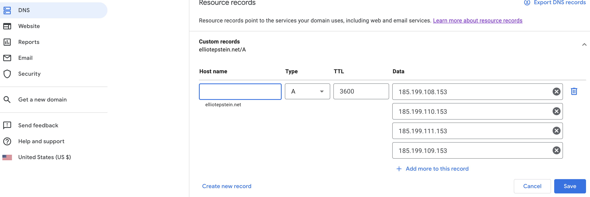
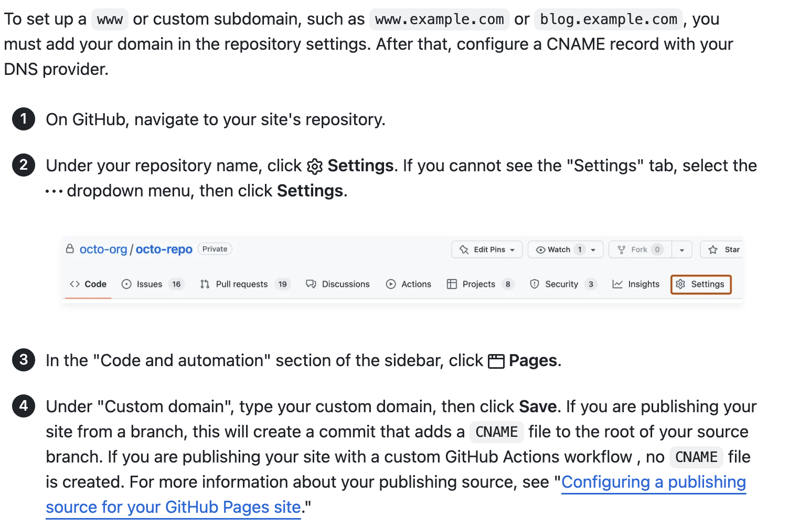

# Creating Your Own Personal Website: A step-by-step guide using Jekyll and Github Pages

This meant as an step-by-step guide for the steps I took to create a [personal website](https://elliotepsteino.github.io/) using **Jekyll** and **Github Pages**, with the source code based on an existing repo by [Leonid Keselman](https://github.com/leonidk). 

All the commands are based on MacOS. 

Please respect copyright of images and pdfs material in this and other repos. 

After exploring various approaches to create a personal website, I found this method particularly effective for several reasons:

1. Hassle-free Hosting: No need to purchase a domain; simply create a GitHub repository that automatically serves as your website's host. For example, if your GitHub username is "elliotepsteino," your website will be accessible at https//:elliotepsteino.github.io.

2. Source Code Availability: GitHub Pages enables easy access to source code from other websites, allowing you to fork their repository. This grants you the advantage of focusing on your desired content rather than worrying about the design aspect.

3. Jekyll's Excellence: Jekyll, a static site generator, seamlessly integrates with GitHub Pages, providing a robust foundation for building your personal website.

Embrace this approach to effortlessly host your website, leverage existing source code, and harness the power of Jekyll for creating your website on GitHub.

## Setup Jekyll:

To install Jekyll, you need to first install [Ruby](https://www.ruby-lang.org/en/). This is a great guide for how to properly set up Ruby: [Guide](https://www.moncefbelyamani.com/how-to-install-xcode-homebrew-git-rvm-ruby-on-mac/). 

With ruby installed, Jekyll is installed simply with 
```
gem install jekyll
```

## Website Design
The next step is to find a website design you like. I will base the rest of the guide on the design I used, which is a small modification of Leonid Keselman's [github repo](https://github.com/leonidk), who based his design on [Jon Barron’s site](https://jonbarron.info/). Another popular design is the Jekyll theme [Minimal](https://github.com/pages-themes/minimal) as well as [Minima](https://github.com/jekyll/minima).

The source code for my site https://elliotepsteino.github.io/ is at: https://github.com/Elliotepsteino/Elliotepsteino.github.io. 

To use the repo, just fork https://elliotepsteino.github.io/ or https://github.com/leonidk and name it yourusername.github.io.

You can then clone it:

```
git clone https://github.com/yourusername/yourusername.github.io.git
cd yourusername.github.io
```

You can now view the website locally at http://127.0.0.1:4000 by running
```
jekyll serve
```
Inside the yourusername.github.io directory.
## Adding Content
To add your own content, just remove the information from the other person, and add your own. 

Files to change:
_layout/default.html: This is the main page for the website, all posts and links social media etc. are added here. 
_posts/: This directory contains the posts for each entry displayed on your main page
_config: Basic configs, like your name, and google analytics tag. 

Replace the images in the /image folder rather than in /tn/images. The images in /tn/images are small, resized images generated by running the script 
```
bash ./_make_thumbnails.sh
``` 
If you get an error message that ‘convert’ is not installed when running the scirpt, first run
``` 
brew install imagemagick
```
To generate a new favicon (small icon on the tab), run  
```
bash ./_make_favicon.sh
```
Do not edit anything in the _site folder, this is an automatically generated folder that will be overwritten. 


Once you like the local version, in the yourusername.github.io folder, you can push it online!
From the website folder, run:
```
git add .
git commit -m “your commit message”
git push 
```
After 10 minutes, you should be able to see your website at https://yourusername.github.io/. 

## Custom Domain Name (optional)
The default domain name https://yourusername.github.io works well, but if you can use a custom domain as well. 

The first step is to buy a domain. These are typically priced on a per year basis with relatively cheap options around 10-20 dollars/year. I bought mine from [Google Domains](https://domains.google/?gad=1&gclid=CjwKCAjwvdajBhBEEiwAeMh1UybQjqc7ROEFr9-rBohft0iffeL_c-aUsVeQyllVBI_I1FLu2Z3WsRoCk8oQAvD_BwE&gclsrc=aw.ds). 
The most popular ending such as .com, .net, .org, and .co are all avialable, and you can easily compare the prices.
Once you have a domain name, you need to link the domain name to github pages.

Assuming you brought a domain on Google Domains, custom records with an [A record](https://en.wikipedia.org/wiki/List_of_DNS_record_types) as in the image: 
 <br>
The IP addresses you need to add are:

```
185.199.108.153
185.199.109.153
185.199.110.153
185.199.111.153
```

These link to Github following this [guide](https://docs.github.com/en/pages/configuring-a-custom-domain-for-your-github-pages-site/managing-a-custom-domain-for-your-github-pages-site). Note that the hostname is left to the default (blank). 

Note that it may take some time (1 hour) before to take effect.

To check that it’s set up properly, run (replace elliotepstein.net with your domain name)

```
elliotepstein.net +noall +answer -t A
```

This should return:
```
elliotepstein.net.	3600	IN	A	185.199.110.153
elliotepstein.net.	3600	IN	A	185.199.111.153
elliotepstein.net.	3600	IN	A	185.199.108.153
elliotepstein.net.	3600	IN	A	185.199.109.153
```
 

You will also need to update your settings on GitHub using steps 1-4 under 'configuring an apex domain' [here](https://docs.github.com/en/pages/configuring-a-custom-domain-for-your-github-pages-site/managing-a-custom-domain-for-your-github-pages-site), a screenshot is pasted below: 



## Google Analytics
You can track how many people visit your site, how they interact with your site, and where they are from using Google analytics. 

Sign up for an account [here](https://analytics.withgoogle.com/) and follow the instructions to create a web stream (click on the start measuring button). Copy your measurement ID and paste it in the _config.yaml file. 
on the line that starts with 
```
Google_analytics:
```
There is also an Google Analytics tag in the default.html right below the head section that should be changed if you use Google Analytics or removed if you don’t use Google Analytics.


## Other Notes
* There are fours categories of posts, so changing sizing requires edits in multiple paces.

* If you thought this was useful, consider starring this repo or linking to [my site](https://elliotepsteino.github.io/) as well as [Leonid Keselmans site](https://leonidk.com/)/[repo](https://github.com/leonidk).
